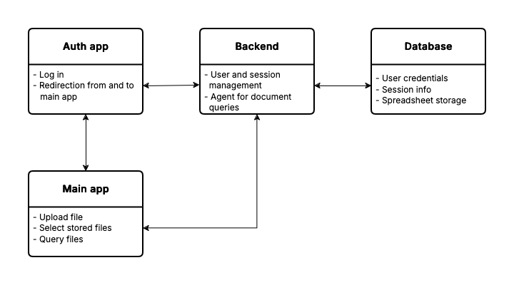

# Solution Description
## Acknowledgment
This repository contains only the requested README file and solely serves the purpose of accompanying my application to you, describing the application. 

## Problem Statement
### Overview
This project is a full-stack application designed to provide data insights by allowing users to upload and query spreadsheets. 
The application is built using the React framework Next.js for the front-end and Python with Flask for the back-end, accompanied by a PostgreSQL database for data storage, user, and session management.

### Detailed Description
The goal was to write a full-stack application for data insights comprising an agent using tools for querying spreadsheets, intended as a helper for writing management summaries, e.g., for business consultants. 

Thereby, files with structured, tabular data can be uploaded and consecutively queried (for descriptive statistics, or basic data analysis such as correlations). 
The submitted files are read via the back-end using pandas and stored encrypted in a PostgreSQL database. 
The requested files are retrieved via the back-end from the database. 
The app allows the user to select and display one of the previously uploaded files showing a history, triggered by a button. 

Additionally, the application requires the users to be authenticated. 
A supplementary authentication app was included for that purpose. 
Upon entering the main application, the user gets redirected to the authentication application if the user did not log in beforehand. 
Session cookies issued by the authentication application via a Flask back-end stored in the browser's cache memory are recognized employing middleware for the respective application.  

The front-end was written in JavaScript or TypeScript respectively using the React framework Next.js, the back-end in Python with Flask and its various extensions such as SQLAlchemy, pandas and LlamaIndex. 
I integrated a PostgreSQL database for user and session management as well as for storing and retrieving recently uploaded (encrypted) files. 
The app with its microservices is deployed on a Virtual Private Server (VPS) with each component as a separated container using Docker operating in a Docker network. 
Version control would be ensured using git with GitHub/GitLab respectively.

## Features
- User authentication and session management.
- Upload and query spreadsheets (CSV/XLS/XLSX files).
- Natural language querying of data tables/spreadsheets.
- Descriptive statistics and basic data analysis (group comparisons, correlations).
- Secure storage and retrieval of (encrypted) files for each user using unique file IDs.

## Architecture
- **Front-end:** React/Next.js
- **Back-end:** Flask and extensions with SQLAlchemy, pandas, and LlamaIndex using the Mistral AI API 
- **Database:** PostgreSQL
- **Deployment:** VPS running Ubuntu, Docker
- **Version Control:** Git/GitHub

<figure>
    
    <figcaption>
        <b>Figure 1.</b>
        Simplified diagram with main components. 
        All components are separated and deployed via Docker containers.
    </figcaption>
</figure>

## Technologies Used
- **Next.js:** A React framework for server-side rendering and static site generation with various packages (e.g., AI SDK for the useChat hook). 
- **TypeScript:** For type safety and better developer experience.
- **Tailwind CSS:** For styling and responsive design.
- **Flask:** For back-end integration, with extensions (Flask-SQLAlchemy, Flask-Session, Flask-cors, etc.).
- **LlamaIndex:** As a framework for building context-augmented generative AI applications with LLMs including agents and workflows. 
- **Docker:** For microservice's deployment within containers.

## Project Structure
The project is organized into three main folders, each serving a distinct purpose:

1. **Front-end (main application):** Contains the Next.js application responsible for the user interface and client-side logic.
2. **Front-end (authentication application):** Contains the Next.js application responsible for the user interface for the authentication process. 
3. **Back-end:** Flask managing server-side operations, including API endpoints for user and session management, data upload and retrieval, and the agent.

## Future Enhancements
- Redis for caching chat history.
- Kubernetes for container orchestration.
- HashiCorp Vault for API token and credentials management.
- CI/CD pipelines using Jenkins and Terraform for automated testing and deployment.
- FastAPI instead of Flask for a more state-of-the-art API solution or to align with the team's tech stack.
- Separated infrastructure folder/repository containing setup files for each microservice (Dockerfiles, Terraform configuration files)